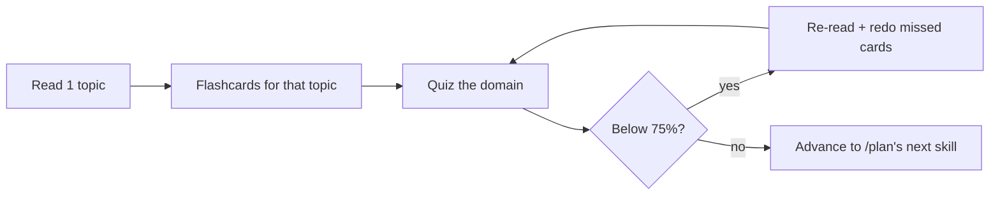

# CCDV-F Study Plan

> Study by **exam weight × your weakness**, not by reading chapters in order. The
> two heaviest domains — **Applications & Integration (33.1%)** and **Model
> Selection & Optimization (16.8%)** — are **~half the scored exam**. Spend your
> time there first, then buy back your weakest domains.

## How to use this plan

1. Take the **diagnostic** first (`/diagnostic` in the app, or the diagnostic set
   in [`mock-exams/`](mock-exams/README.md)). It produces a per-domain readiness
   index and ranks your weak skills.
2. The app's **`/plan`** page already computes a personalized, weight-aware queue
   (priority = 0.55·gap + 0.30·overdue + 0.15·exam-weight, plus a boost for
   recently-missed skills). Use it as your daily worklist.
3. Pick the calendar plan below that matches your starting point. Each day ends
   with **active recall** (flashcards) and **retrieval practice** (quiz), because
   testing yourself beats re-reading.
4. Re-check readiness with [`READINESS-CHECKLIST.md`](READINESS-CHECKLIST.md)
   before you book the exam.

Exam facts to plan around: **53 items, 120 minutes** (~2.25 min/item),
multiple-choice and multiple-response, scaled 100–1000, **cut score 720**. See
[`SOURCES.md`](SOURCES.md).

---

## Time budget by domain (spend proportional to weight)

| Priority | Domain | Weight | Rough share of study time |
|---|---|---:|---:|
| 1 | Applications & Integration (D2) | 33.1% | ~1/3 |
| 2 | Model Selection & Optimization (D5) | 16.8% | ~1/6 |
| 3 | Agents & Workflows (D1) | 14.7% | ~1/7 |
| 4 | Prompt & Context Engineering (D6) | 11.0% | ~1/9 |
| 5 | Tools & MCPs (D8) | 10.6% | ~1/9 |
| 6 | Security & Safety (D7) | 8.1% | ~1/12 |
| 7 | Claude Code (D3) | 3.1% | light |
| 8 | Eval, Testing & Debugging (D4) | 2.6% | light |

> D3 and D4 are small — learn the **distinctions** (which mechanism / which layer)
> and move on. Don't over-invest in 3%.

---

## 7-day plan — experienced Claude/API developers

You already ship against the API; this sprint hardens exam-specific reasoning and
the version-sensitive facts.

- **Day 1 — Diagnostic + D2 core.** Take the diagnostic. Review Messages API
  (statelessness, `system` param, roles, `max_tokens`, `stop_reason`), content
  blocks, streaming SSE events. Quiz D2.
- **Day 2 — D2 depth.** Prompt caching (write 1.25x/read 0.1x, 1-hour 2.0x,
  breakpoint placement, the timestamp trap), error handling (429 vs 529, spend-cap
  429 has no `retry-after`, backoff+jitter, idempotency), batch vs realtime,
  vision. Quiz D2 again; target 85%+.
- **Day 3 — D5.** Model tradeoffs (Haiku/Sonnet/Opus), token/context budgeting,
  `count_tokens` (input only, no caching), sampling & non-determinism, migration
  (pin versions, shadow/canary, re-run evals). Quiz D5.
- **Day 4 — D1 + D8.** Workflow vs agent (and *when not* to use an agent), the
  agent loop + loop guards, Agent SDK, orchestration/subagents; tool-use lifecycle,
  `tool_choice`, parallel calls, MCP fundamentals. Quiz both.
- **Day 5 — D6 + D7.** Prompt vs context engineering, context bloat/pruning/
  compaction, structured output via forced tool schema; prompt injection (direct &
  indirect), least privilege, human-in-the-loop, secrets. Quiz both.
- **Day 6 — D3 + D4 + traps.** Claude Code mechanisms (CLAUDE.md/Rules/Skills/
  Commands/Agents/Hooks), headless exit codes; integration-vs-model-output
  debugging, evals. Read [`common-traps/`](common-traps/README.md).
- **Day 7 — Mock Exam 1 (full length, timed).** Review every miss and its
  distractor rationale. Re-check the readiness checklist.

## 14-day plan — moderate Claude experience

Weeks pair a **learn day** with a **practice day**.

- **Days 1–2 — Orientation + D2 part 1.** Exam overview, Messages API, streaming.
- **Days 3–4 — D2 part 2.** Prompt caching, error handling, batch, vision. Quiz D2.
- **Days 5–6 — D5.** All four D5 skills. Cheat sheet + quiz.
- **Days 7–8 — D1.** Workflow-vs-agent, agent loop, SDK, orchestration. Quiz.
- **Day 9 — D8.** Tool use + MCP. Quiz.
- **Day 10 — D6.** Prompt & context engineering, structured output. Quiz.
- **Day 11 — D7.** Security scenarios. Quiz.
- **Day 12 — D3 + D4.** Claude Code + eval/debugging. Quiz. Read common traps.
- **Day 13 — Mock Exam 1**, full review.
- **Day 14 — Mock Exam 2**, targeted review of weakest domain; readiness check.

## 30-day plan — starting from fundamentals

Four weeks: **learn broadly → deepen → practice → simulate.**

- **Week 1 — Foundations (D2 + D5).** One topic/day with its flashcards; short
  quizzes. By day 7 you can explain statelessness, roles, `stop_reason`, streaming,
  caching, errors, model tradeoffs, tokens.
- **Week 2 — Agentic + engineering (D1, D8, D6).** One topic/day. Build the agent
  loop mental model; tool-use lifecycle; prompt vs context engineering. Redo any
  quiz domain below 70%.
- **Week 3 — Safety + ops + consolidation (D7, D3, D4).** Security scenarios,
  Claude Code mechanisms, debugging layers. Read all cheat sheets and comparison
  tables. Take the **diagnostic** again — compare to day 1.
- **Week 4 — Simulate.** Mock Exam 1 (day 22), review; Mock Exam 2 (day 25),
  review; Mock Exam 3 (day 28), review. Final two days: flashcard blitz on
  recently-missed skills + the common-traps list; confirm readiness ≥ your target.

---

## Daily loop (any plan)

Study heuristics here are **preparation aids, not a prediction of passing**. The
platform does not guarantee exam success. See
[`READINESS-CHECKLIST.md`](READINESS-CHECKLIST.md).
