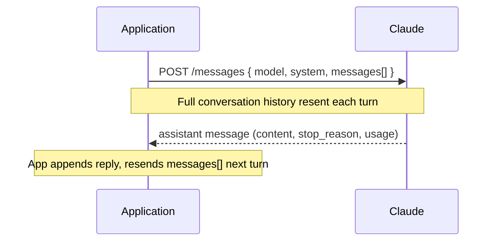
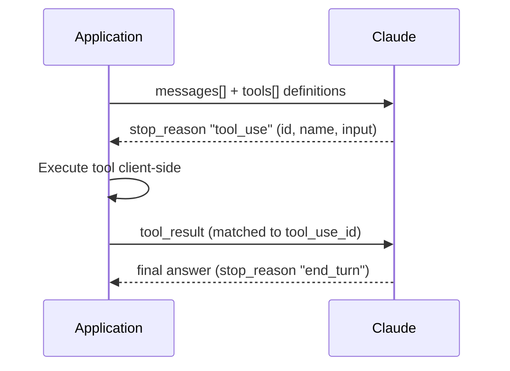
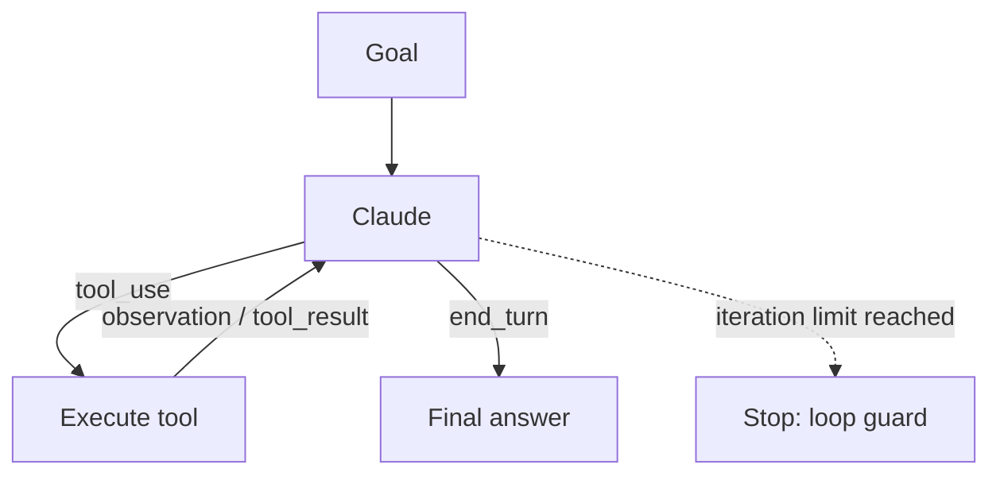
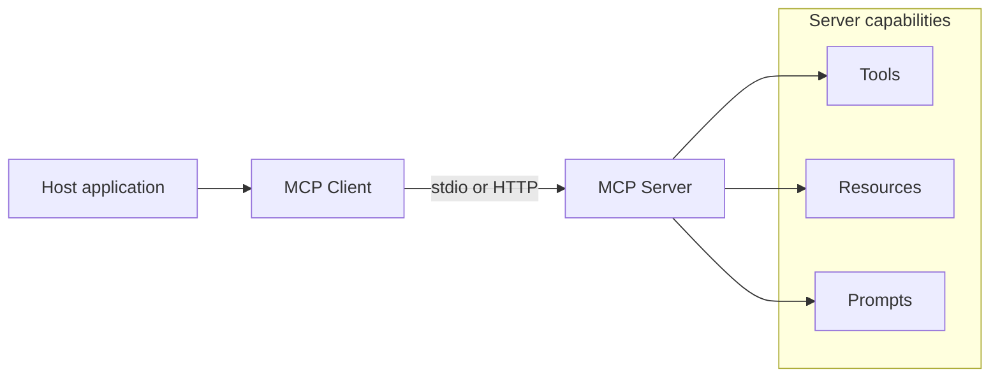
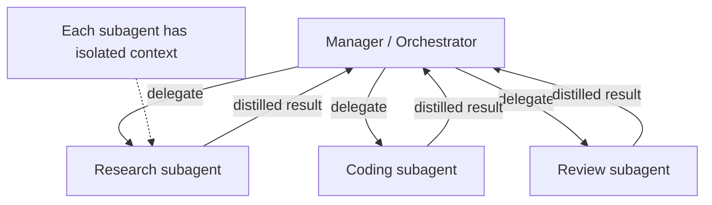
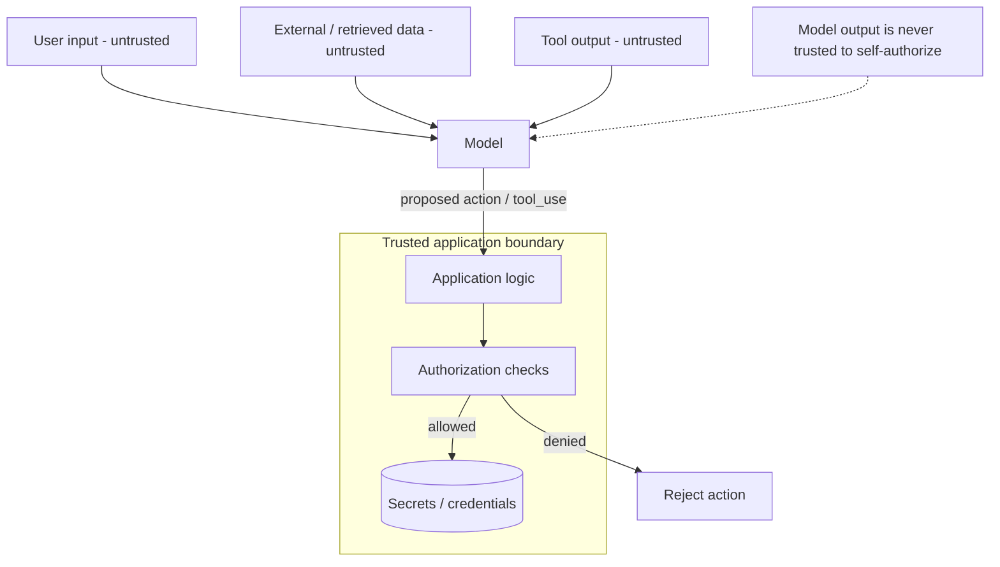
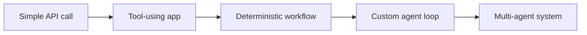

# Architecture Patterns — Diagrams

Fast-revision diagrams for the CCDV-F exam. Each diagram has a one-line caption. Read the caption, then the diagram.

Current model baseline (2026-09): Claude Fable 5 (most capable GA), Claude Mythos 5 (limited availability, Project Glasswing), Opus 5, Sonnet 5, Haiku 4.5.

---

## 1. Messages API — request/response (stateless)

The API is stateless: the server keeps no memory, so the full `messages[]` array is resent on every turn.

---

## 2. Tool use loop

Claude never runs tools; it emits `tool_use`, the application executes client-side and returns a `tool_result` keyed by `tool_use_id`.

---

## 3. Agent loop

Claude drives toward a goal by looping tool_use -> execute -> observation until it stops with `end_turn`; a max-iteration guard prevents runaway loops.

---

## 4. MCP architecture

MCP standardizes how a host connects to servers that expose Tools, Resources, and Prompts over stdio or HTTP transport.

---

## 5. Multi-agent (orchestrator / workers)

A manager delegates to specialized subagents; each runs in isolated context and returns only distilled results, keeping the manager's context clean.

---

## 6. Security trust boundary

Untrusted data (retrieved content, tool output) crosses into the model; authorization and secret access are enforced in the application, never in the prompt.

---

## 7. The escalation ladder

Use the simplest approach that works; climb only when the task demands it.

---

_Facts verified against official Anthropic docs as of 2026-09-09. Re-check version-sensitive figures (model lineup, pricing multipliers) before relying on them._
