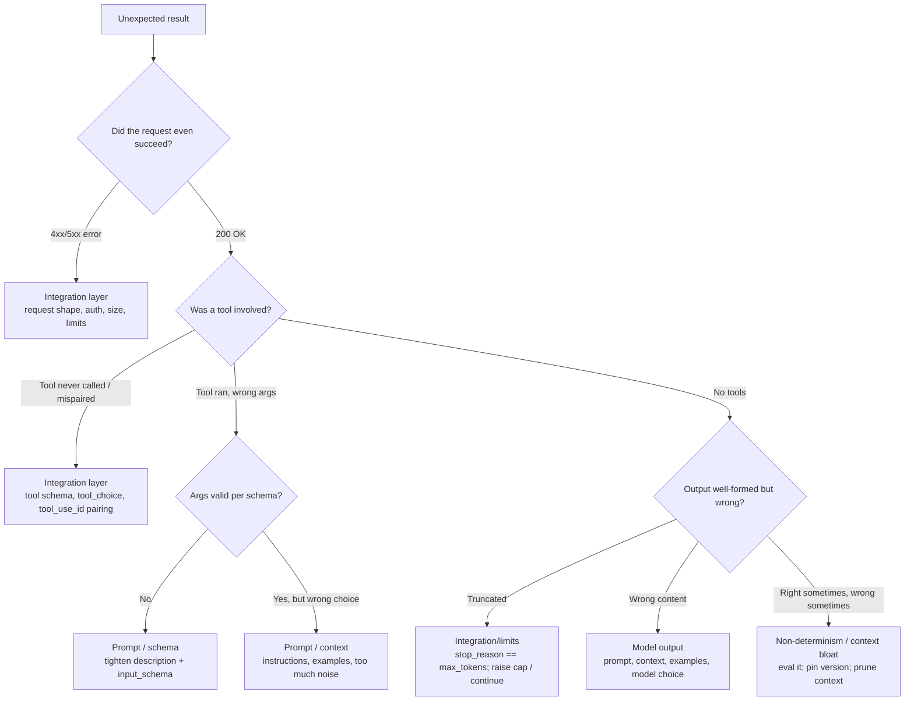

## Core Concept

Shipping a Claude app is not "does it run" — it's "does it still behave when the
prompt, the model, or the data changes." That is what **Domain 4** tests: build
**evals** (repeatable tests of behavior), run the right **kind** of test for the
question you're answering, and when something breaks, **isolate the layer** before
you touch anything.

Three habits carry the whole domain:

1. **Eval before vibes.** Judge changes against a dataset with expected outputs,
   not a single hand-tried prompt.
2. **Right test for the question.** Unit test deterministic code, integration test
   the request/response round-trip, and use an **eval** for model *behavior* that
   has no single string answer.
3. **Isolate before you fix.** Every failure is either an **integration-layer**
   bug (your code, request shape, tool wiring, parsing) or a **model-output** bug
   (the content Claude produced). Fixing the wrong layer is the most common way to
   waste an afternoon.

## Key Facts & Mechanics

- **Eval dataset (golden set):** a fixed collection of inputs plus expected
  outputs or a grading rubric. You re-run it on every prompt/model change to catch
  **regressions**. Start small (dozens of cases that mirror real traffic) and grow it
  from production failures.
- **Grading methods, cheapest first:**
  - **Exact / programmatic match** — best when the output is structured or
    enumerable (a label, JSON, a number). Deterministic and free.
  - **Assertions / code checks** — "contains", "is valid JSON", "passes schema",
    "no PII" — cheap and reliable for contracts.
  - **Model-graded (LLM-as-judge)** — a second Claude call scores open-ended
    quality against a rubric. Use when there is no single correct string; keep the
    rubric explicit and validate the judge against human labels on a sample.
- **Regression testing:** the eval suite is your regression net. A model migration
  or a prompt edit is "safe" only when the golden set holds.
- **Non-determinism:** identical inputs can yield different outputs. To make a run
  reproducible for debugging, pin the **model version**, set **`temperature: 0`**
  (greedy), and hold the prompt/tools constant — but never *assume* byte-identical
  output; assert on **properties**, not exact strings, for anything generative.
- **Trace analysis:** capture the exact `messages[]` you sent, the raw response
  (including `stop_reason`), and every `tool_use` / `tool_result`. The trace is what
  tells you which layer owns the bug.
- **Observability in production:** log request/response metadata (model, token
  usage, `stop_reason`, latency, error codes) and sample full traces. You cannot
  debug what you did not record.

## The debugging decision tree



## Annotated Code

```python
# A minimal regression eval: exact-match for a classifier prompt.
# Run this on every prompt or model change; fail CI if pass-rate drops.
GOLDEN = [
    {"input": "My card was charged twice", "expected": "billing"},
    {"input": "How do I reset my password?", "expected": "account"},
    {"input": "The app crashes on launch",  "expected": "bug"},
]

def grade(client, model, case):
    resp = client.messages.create(
        model=model, max_tokens=16, temperature=0,      # pin + greedy for reproducibility
        system="Classify into exactly one of: billing, account, bug. Reply with the label only.",
        messages=[{"role": "user", "content": case["input"]}],
    )
    got = resp.content[0].text.strip().lower()
    return got == case["expected"], got            # programmatic match = cheap + deterministic

def run_eval(client, model):
    results = [grade(client, model, c) for c in GOLDEN]
    passed = sum(ok for ok, _ in results)
    return passed / len(results)                    # gate a migration on this pass-rate
```

## Unit vs Integration vs Eval — the distinction the exam draws

| | **Unit test** | **Integration test** | **Eval** |
|---|---|---|---|
| **Target** | Your pure functions (parsing, ret/backoff, tool executors) | The request → response round-trip and tool loop | Model *behavior* / output quality |
| **Determinism** | Deterministic | Mostly deterministic (mock the API) | Non-deterministic; grade on properties |
| **Answers** | "Is my code correct?" | "Do the pieces wire together?" | "Is the model doing the right thing?" |
| **Grading** | Assertions | Assertions on shape/flow | Exact-match, assertions, or model-graded |
| **When it fails** | Fix code | Fix wiring/config | Fix prompt/context/model, or the eval |

## Mental Model

Debugging a Claude app is **splitting the stack into "my code" and "the model's
answer."** A trace is the X-ray: a malformed request or a mispaired `tool_result`
is *yours*; a well-formed request with wrong *content* is a prompt/context problem.
An **eval** is a **regression net** stretched under the whole thing — it does not
prevent one bad answer, it catches the day a "harmless" prompt tweak quietly breaks
ten others.

## Common Traps

<Callout type="trap" title="Judging a change by one hand-tried prompt">
**Trap:** Editing a prompt, trying it once, and shipping. One success is anecdote,
not evidence. Run the **golden set** — that's the only way to see the regressions a
single trial hides.
</Callout>

<Callout type="trap" title="Blaming the model for an integration bug">
**Trap:** Rewriting the prompt when the real fault is a malformed request, a bad
tool schema, or a missing `tool_result`. Read the **trace** first — a `400` is
almost always yours.
</Callout>

<Callout type="trap" title="Expecting byte-identical output">
**Trap:** Writing an assertion that pins the exact response string. Generation is
non-deterministic; even `temperature: 0` is not a guarantee across versions. Assert
on **properties** (valid JSON, correct label, contains the fact), not exact text.
</Callout>

<Callout type="trap" title="Trusting an ungraded LLM judge">
**Trap:** Using model-graded eval without ever checking the judge against humans.
An unvalidated judge can be confidently wrong. Calibrate it on a labeled sample and
keep its rubric explicit.
</Callout>

## Exam Tips

- Match the **test type to the question**: code correctness → unit; wiring →
  integration; behavior/quality → eval.
- The exam-correct debugging move is almost always **"read the trace / isolate the
  layer first,"** not "change the prompt."
- Grade with the **cheapest method that works**: exact-match or assertions before
  reaching for an LLM judge.
- A migration is safe when the **regression eval holds**, not when one prompt looks
  fine.

## Scenario Challenges

<RevealAnswer title="Scenario: right sometimes, wrong sometimes" prompt="A summarization endpoint returns a great summary most of the time but occasionally drops a key section. What do you do FIRST?">
Build an **eval**, don't chase the one bad output. Collect a dataset of inputs
(including the failing cases), define a property-based grade (e.g. "mentions each
required section"), and measure the current pass-rate. Only then change the prompt
or model — and re-run the eval to prove the fix actually raised the rate without
regressing the good cases. Reacting to a single sample is how you fix one case and
break three.
</RevealAnswer>

<RevealAnswer title="Scenario: is it my bug or the model's?" prompt="An agent intermittently returns a 400 'messages: unexpected role' on some turns. Where do you look first?">
The **integration layer**. A `400` with a *structural* message means the request is
malformed — likely non-alternating roles or a mispaired `tool_use`/`tool_result` —
not a reasoning failure. Trace the exact `messages[]` on the failing turns.
Rewriting the prompt would not touch the real cause.
</RevealAnswer>

<RevealAnswer title="Scenario: grading open-ended answers" prompt="You need to score the quality of free-form support replies at scale, and there's no single correct string. What grading approach fits, and what's the catch?">
Use **model-graded (LLM-as-judge)** eval with an explicit rubric, because exact
match cannot score open-ended text. The catch: **validate the judge** against a
human-labeled sample first, keep the rubric concrete, and sanity-check for judge
bias — an unvalidated judge just launders the same uncertainty you were trying to
measure.
</RevealAnswer>
